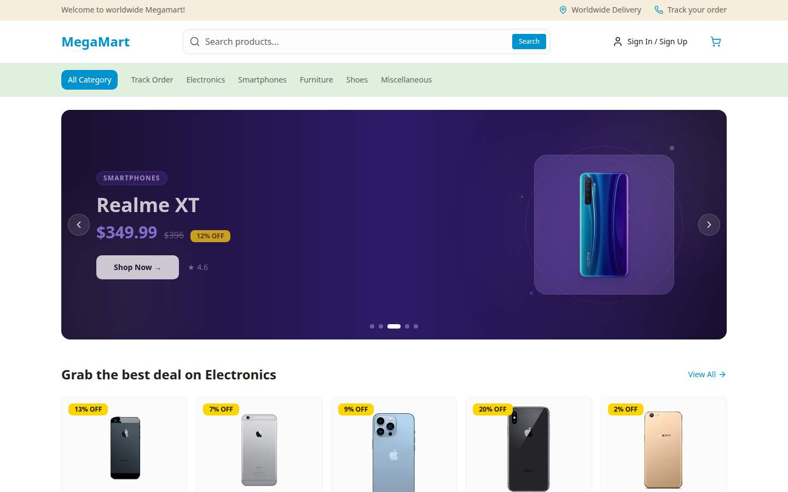
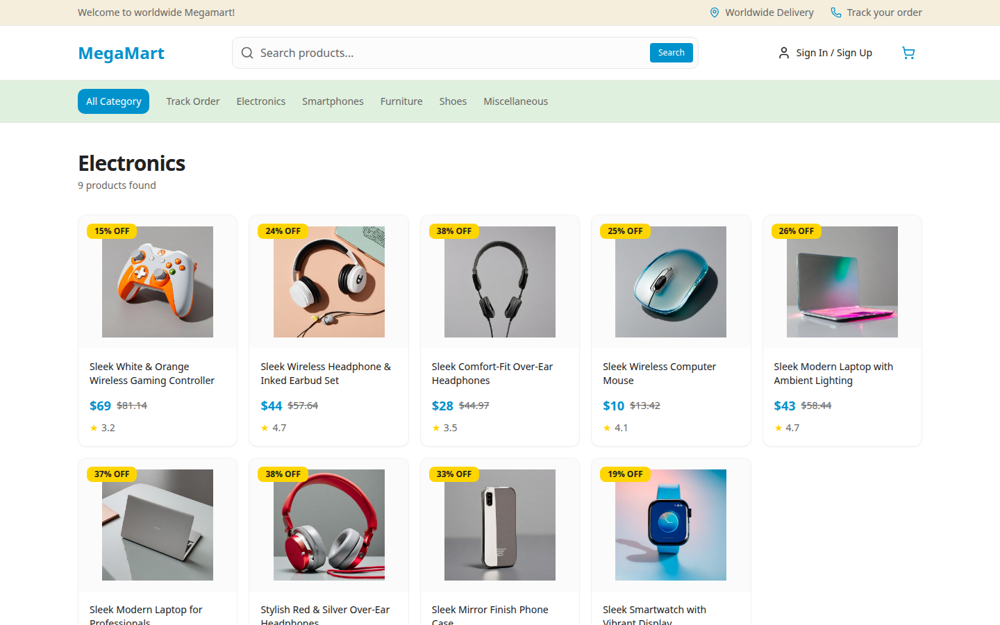
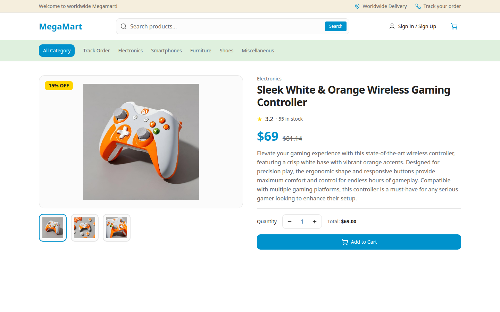
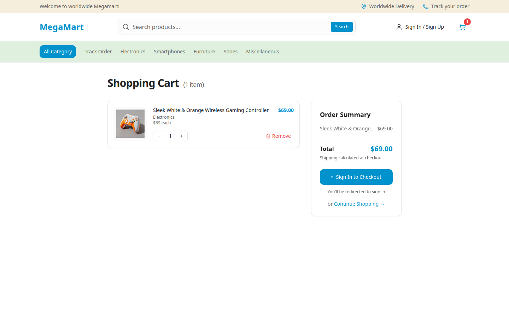
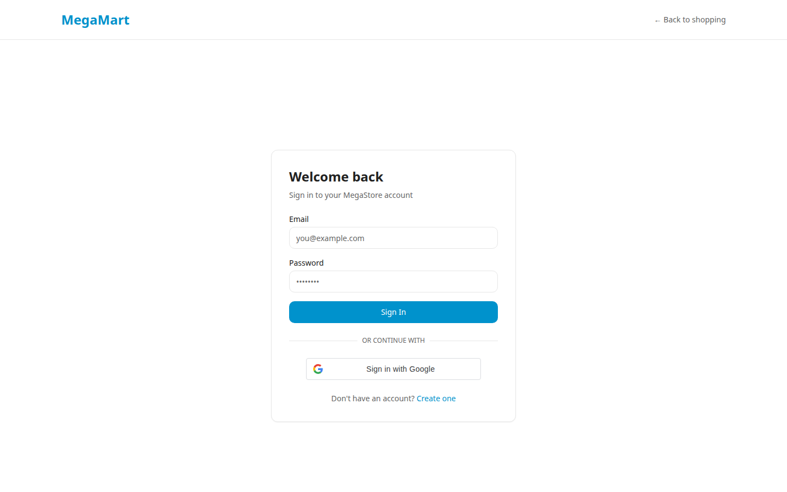

# MegaMart

[](https://github.com/Olowodarey/megastore/actions/workflows/ci.yml)

A full-stack e-commerce platform built as a portfolio project — a NestJS REST API with PostgreSQL, a Next.js 15 storefront, JWT + Google OAuth authentication, and a real Paystack card-payment integration with live USD→NGN conversion.

**Live demo:** [megastore-snowy.vercel.app](https://megastore-snowy.vercel.app)

---

## Screenshots

| Home | Category |
| --- | --- |
|  |  |

| Product detail | Cart |
| --- | --- |
|  |  |

| Login (Google + password) |
| --- |
|  |

---

## Tech Stack

| Layer      | Tech                                                     |
| ---------- | --------------------------------------------------------- |
| Frontend   | Next.js 15, React 18, TypeScript, Tailwind CSS            |
| State      | Redux Toolkit, RTK Query                                  |
| Backend    | NestJS, Prisma ORM                                        |
| Database   | PostgreSQL                                                |
| Auth       | JWT (bcryptjs + Passport), Google Sign-In (ID token)      |
| Payments   | Paystack (inline card checkout, live USD→NGN conversion)  |
| Testing    | Jest (backend unit tests), Playwright (e2e)               |
| CI/CD      | GitHub Actions, Railway (backend), Vercel (frontend)      |

---

## Features

- **Product catalogue** — products across 5 categories seeded from Platzi Fake Store and DummyJSON APIs
- **Search** — full-text search across product titles and descriptions
- **Category pages** — Electronics, Smartphones, Furniture, Shoes, Miscellaneous
- **Product detail** — image gallery with clickable thumbnails, ratings, stock, discount pricing
- **Shopping cart** — add/remove/adjust quantity, persisted to localStorage
- **Auth** — email/password with enforced strong-password rules (8+ chars, upper/lower/number/symbol), plus **Sign in with Google** (ID-token verification, no redirect flow)
- **Orders** — checkout places a real order via the API; order history with a visual tracking progress bar (Pending → Processing → Shipped → Delivered)
- **Payments** — Paystack inline checkout on the order page; the backend fetches a live USD→NGN exchange rate, converts the order total, and verifies the transaction server-side before marking an order paid
- **Session handling** — auth state survives hard refreshes with no false "please log in again" redirects; a genuinely expired token cleanly logs the user out with a toast instead of failing silently
- **Hero banner** — auto-playing carousel of top-rated products with themed slides
- **Responsive** — fully mobile and desktop compatible, with a focused, distraction-free header/footer on the login and register pages

---

## Project Structure

```text
megastore/
├── frontend/                    # Next.js 15 frontend
│   ├── app/
│   │   ├── _components/         # Header, Footer, Cards, Banner, GoogleSignInButton
│   │   ├── _lib/                 # Redux slices (cart, auth)
│   │   ├── _services/            # RTK Query API endpoints
│   │   ├── account/orders/       # Order history, detail + Paystack pay button
│   │   ├── category/             # Category listing
│   │   ├── products/             # Product detail
│   │   ├── cart/                 # Cart & checkout
│   │   ├── login/ register/
│   │   └── search/
│   ├── e2e/                      # Playwright end-to-end tests
│   └── redux/                    # Store configuration
│
└── backend/                     # NestJS backend
    ├── src/
    │   ├── auth/                 # JWT + Google Sign-In, strong password validation
    │   ├── orders/                # Create/retrieve orders, Paystack init + verify
    │   ├── products/              # List, search, category, detail
    │   └── prisma/                # Database service
    └── prisma/
        ├── schema.prisma
        ├── migrations/
        └── seed.ts                # Seeds from Platzi + DummyJSON
```

---

## Getting Started

**Prerequisites:** Node.js 20+, npm, PostgreSQL

### Backend Setup

```bash
cd backend
npm install
cp .env.example .env
# Edit .env — see "Environment Variables" below
npx prisma generate
npx prisma migrate dev
npm run db:seed
npm run start:dev
```

Backend runs at: `http://localhost:4000/api/v1`

### Frontend Setup

```bash
cd frontend
npm install
cp .env.local.example .env.local
# Edit .env.local — see "Environment Variables" below
npm run dev
```

Frontend runs at: `http://localhost:3000`

### Environment Variables

**Backend (`backend/.env`)**

| Variable | Description |
| --- | --- |
| `DATABASE_URL` | PostgreSQL connection string |
| `JWT_SECRET` / `JWT_EXPIRES_IN` | JWT signing secret and token lifetime |
| `WEB_ORIGIN` | Comma-separated list of allowed CORS origins |
| `PAYSTACK_SECRET_KEY` | Paystack secret key (test or live) |
| `PAYSTACK_CURRENCY` | Currency Paystack charges in (default `NGN`) |
| `GOOGLE_CLIENT_ID` | Google OAuth Client ID (for verifying Google ID tokens) |

**Frontend (`frontend/.env.local`)**

| Variable | Description |
| --- | --- |
| `NEXT_PUBLIC_API_URL` | Backend base URL, **including** `/api/v1` |
| `NEXT_PUBLIC_PAYSTACK_PUBLIC_KEY` | Paystack public key |
| `NEXT_PUBLIC_GOOGLE_CLIENT_ID` | Same Google OAuth Client ID as the backend |

---

## Testing

```bash
# Backend unit tests (Jest) — auth + orders service logic, Prisma/Paystack/Google mocked
cd backend && npm test

# Frontend e2e (Playwright) — browse -> product detail -> add to cart -> checkout gate
cd frontend && npx playwright install chromium && npm run test:e2e
```

The e2e suite deliberately stops at the checkout gate rather than placing a real order, so it's safe to run repeatedly (including in CI) against the live API without creating fake accounts or orders.

---

## API Reference

```text
POST  /api/v1/auth/register                    strong password required
POST  /api/v1/auth/login
POST  /api/v1/auth/google                       { idToken } from Google Identity Services
GET   /api/v1/auth/me                            (protected)

GET   /api/v1/products                          ?search= ?category= ?page= ?pageSize=
GET   /api/v1/products/categories
GET   /api/v1/products/category/:name
GET   /api/v1/products/:id

GET   /api/v1/orders                             (protected)
POST  /api/v1/orders                             (protected)
GET   /api/v1/orders/:id                         (protected)
POST  /api/v1/orders/:id/payment-init            (protected) — returns live USD->NGN amount for Paystack
POST  /api/v1/orders/:id/verify-payment          (protected) — server-side Paystack verification
```

---

## Deployment

### Backend (Railway)

1. Deploy from `backend/` directory
2. Add a PostgreSQL database
3. Set the environment variables listed above
4. Migrations run via `prisma migrate deploy`; the app keeps its DB connection warm with a periodic ping to avoid slow first-request cold starts

### Frontend (Vercel)

1. Deploy from `frontend/` directory
2. Set the frontend environment variables listed above (Production, Preview, and Development)
3. Deploy

### CI

GitHub Actions runs on every push/PR: backend typecheck + build + unit tests, frontend typecheck + build, and the Playwright e2e suite against the live deployment. See `.github/workflows/ci.yml`.

---

## Author

Built by **Darey Olowo** — [08142293610](tel:08142293610)
